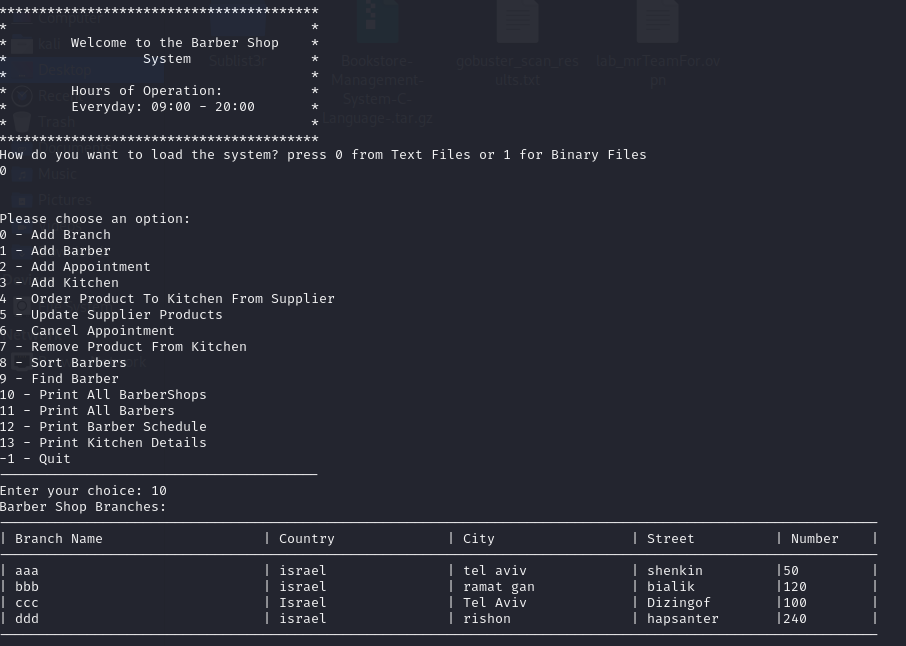

# Hairdressing Management System

This project is a comprehensive information management system developed in C for managing a network of barbershops. It includes functionalities for adding branches, inserting new barbers into the system, branch and barber management, customer appointment scheduling, kitchen addition, supplier orders, and more.


## Features

- Dynamic memory allocation
- Linked lists
- File manipulation (text and binary)
- Compression techniques
- Macros
- Interactive user interface

## Getting Started

To get a local copy up and running, follow these simple steps:

1. Clone the repository: 
   ```bash
   git clone https://github.com/omrip500/Hairdressing-Management-System-C-Language-.git

2. Enter the final project directory:
   ````bash
   cd Bookstore-Management-System-C-Language-

2. Compile the source code:
   ```bash
   cd finalProject

3. Use Make to build the project:
    ```bash
   make

3. Run the executable:
   ```bash
   ./main


## Usage
Once the program is running, follow the prompts to navigate through the various functionalities of the hairdressing management system.

## Contributing
Contributions are welcome! Feel free to fork the repository and submit pull requests.


